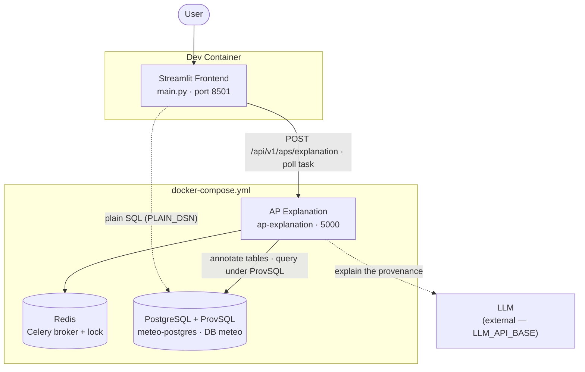

# Provenance Explorer: Zurich weather

A Streamlit app about [**ap-explanation**](https://github.com/datagems-eosc/ap-explanation)
and the meteo question set, in four tabs.

**📋 Summary** — all 752 questions in one table, each row coloured: 🟢 runs without issue,
🟡 may exhaust memory (estimated above the 3 GB limit used for the measurements), 🔴 not
supported (rejected by ap-explanation, or failing at run time).

**📊 Theoretically supported questions** — how many of the set's 752 questions ap-explanation supports (548) and why the
other 204 are not, grouped by cause (scalar subquery reading a CTE, `HAVING`, `ORDER BY` on an
aggregate, aggregates ProvSQL cannot explain, window functions, subqueries in conditions, and a
ProvSQL bug on `COUNT(DISTINCT …)`), with the questions and an example for each. The data is
ap-explanation's `fixtures/meteo_queries.csv`, produced by its
`scripts/classify_meteo_queries.py` (`assets/meteo_queries.csv` here, SQL kept for the
unsupported questions only).

**🧠 Memory analysis** — the questions whose provenance can exhaust the database's memory,
and why. All measurements ran on a PostgreSQL + ProvSQL server limited to **3 GB of RAM and no
swap** (`docker run --memory=3g --memory-swap=3g`); the tab lists its databases and their row
counts. Two query shapes make ProvSQL's evaluation outgrow memory, and ProvSQL
ignores cancellation while evaluating, so only the OOM killer or a restart ends the run:

1. **A comparison on an aggregate computed in a CTE or subquery** (Q295's `WHERE
   total_precipitation > 0.001` on monthly sums, or a `HAVING` rewritten as a nested
   `SELECT`): ProvSQL expands it over the combinations of the group's readings, about 3× the
   memory per reading (0.9 GB at 20 readings, over 3 GB at 22).
2. **An aggregate over many rows**: the formula lists every row the aggregate reads, about
   3 KB each, and memory follows the largest group. That adds up over the 134,280 elevation
   points of a cell (400 MB), over large regions, and above all when readings are joined to
   the elevation table, each reading paired with every point of its cell (1.85 GB for one
   month above 500 m).

Shape 1 concerns every semiring but `boolexpr` (`formula` and `why` from 22 readings, `how`
and `which` from 24–26; the probability is unaffected), shape 2 `formula` only, the one
semiring ap-explanation explains aggregates with.

The tab lists every question with either shape, its estimated memory, and, for the City of
Zurich questions the demo's data can answer, the peak measured on a 3 GB-capped database.
It reads files produced by three scripts:

| Script | Output | What it does |
|--------|--------|--------------|
| `scripts/memory_analysis.py` | `assets/memory_risk.csv` | Finds both shapes in the SQL of every question (sqlglot) and estimates their memory |
| `scripts/memtest_group_size.sh` | `assets/memory_group_size.csv` | Measures shape 1 against the size of the compared group |
| `scripts/memtest_questions.py` | `assets/memory_sweep.jsonl` | Runs questions through ap-explanation and records their peak memory |

The two measurement scripts need a throwaway, memory-capped database; their docstrings give
the commands. Never run them against a shared database.

**🔎 Query runner** — runs a question through ap-explanation and shows:

| Section | What it shows | Source |
|---------|---------------|--------|
| **SQL** | The query of the AP's `Provenance_SQL_Operator` | `assets/aps/<ID>.json` |
| **Run cost** | Total time, database time, peak database memory, plain SQL time | see [Run cost](#run-cost) |
| **1. Plain SQL answer** | What SQL alone returns | the query run on the database, without ProvSQL |
| **2. What provenance adds** | Per result row, the ProvSQL formula and the readings it cites (date, place, value in °C / mm / m/s) | `ap-explanation` `POST /api/v1/aps/explanation[/{semiring}]` |
| **3. LLM explanation** | The explanation ap-explanation writes from the query, its answer and the provenance | same call |

Each question can be **run live** on ap-explanation (about 15–40 s, mostly the LLM call) or
**replayed** from the response recorded when the demo was made (`assets/recorded/`), which needs
no service at all.

## The questions

Six questions from the meteo question set, over one ERA5 cell (City of Zurich, 47.4 / 8.5,
2005–2019). They come from ap-explanation's `fixtures/meteo_examples/` (see its `NOTES.md`).

| AP | Question | Tables | What the provenance adds |
|----|----------|--------|--------------------------|
| G81 | 10 lowest temperatures, July 2015 | `meteo_tmin` | the date of each temperature |
| F50 | Number of readings above 30 °C in 2015 | `meteo_tmax` | the 13 hot days behind the count |
| K247 | Frost days in each January, 2005–2015 | `meteo_tmin` | the dated frost days behind each yearly count |
| C155 | Location of the highest wind speed, 2018–2019 | `meteo_windspeedmax`, `meteo_elevation` | the day of the max (storm Burglind), and that the elevation join is useless |
| T157 | Highest precipitation at the highest point, ISO week 46 of 2011 | `meteo_tp`, `meteo_elevation` | the 7 dry days of the week, each paired with the highest point |
| Q295 | Last month of 2019 with more than 1 mm of precipitation | `meteo_tp` | nothing: **recorded failure only**, see [Known limitations](#known-limitations) |

---

## Run cost

After a live run, the Query runner shows:

- **Total time**: from submitting the AP to the task settling, LLM call included.
- **Database time** and **peak database memory**: a thread samples, every 0.1 s,
  `pg_stat_activity` and each of the run's PostgreSQL backends' `/proc/<pid>/status`
  (through `pg_read_file`, which needs a superuser: the demo's `provdemo` is one). Database
  time adds up the samples where one of the run's backends is running a statement; memory is
  the highest sum of their private memory (`RssAnon`, shared buffers excluded).
  ap-explanation opens a fresh connection pool per task, so the backends that appear during
  the run are the run's.
- **Plain SQL time**: the same query without provenance.

ap-explanation caches results for an hour under a key made of the whole AP. A cache hit
skips all database work, so each live run stamps the AP's `startTime` with the time of the
run, and computes afresh. Recorded runs only have their total and plain SQL times.

---

## Architecture



**Flow of a live run:**

1. The frontend POSTs the AP to ap-explanation and gets a `task_id`. Picking a semiring
   posts to `/{semiring}`; the default computes them all (aggregate queries only get
   `formula`).
2. ap-explanation's Celery task annotates the AP's tables with provenance, runs the query
   under ProvSQL, resolves the rows each formula cites, then asks the LLM to explain it.
3. The frontend polls `GET /api/v1/aps/explanation/{task_id}` until the task settles, and
   runs the same query plainly on `PLAIN_DSN` for comparison.

The database (`meteo-postgres`) is seeded on first start from `dependencies/postgres-seed/`:
`01_meteo.sql` creates schema `meteo` with the column types of the dev server's
`ds_era5_land`, and loads the CSVs in `data/` (fetched from the Open-Meteo archive, model
`era5_seamless`, by ap-explanation's `scripts/meteo_examples/load_era5.py`).

The HTTP client under `generated/` is auto-generated with
[Kiota](https://github.com/microsoft/kiota) from ap-explanation's OpenAPI spec.

---

## Running the demo

### 1. Authenticate with GitHub Container Registry

Sidecar images are on GHCR. Create a [GitHub PAT](https://github.com/settings/tokens)
with the `read:packages` scope, then:

```sh
echo YOUR_GITHUB_PAT | docker login ghcr.io -u YOUR_GITHUB_USERNAME --password-stdin
```

### 2. Pick the ap-explanation image

The meteo questions need the sql_rewriter changes released **after ap-explanation v1.1.1**
(aggregate provenance, `col_<i>` naming). `docker-compose.yml` pins
`ghcr.io/datagems-eosc/datagems-eosc/ap-explanation:v1.2.0`. Until that tag is published,
build an image from an ap-explanation checkout and point at it in `.env`:

```sh
docker build --target prod -t ap-explanation:local ../../ap-explanation
cp .env.example .env
# then in .env:
# AP_EXPLANATION_IMAGE=ap-explanation
# AP_EXPLANATION_TAG=local
```

### 3. Configure the LLM (optional)

Set `LLM_API_BASE`, `LLM_API_KEY` and `LLM_API_MODEL` in `.env` (an OpenAI-compatible
endpoint). Without them, ap-explanation still computes the provenance, but writes no
explanation.

### 4. Open in the dev container

Open the repo in VS Code → **Reopen in Container**. This starts the sidecars (PostgreSQL +
ProvSQL, Redis, ap-explanation) via `docker-compose.yml`.

### 5. Run the app

```sh
streamlit run main.py
```

With no sidecars at all, the **Show recorded run** button still works; **Run on
ap-explanation** is disabled until `AP_EXPLANATION_SERVICE_URL` answers on `/api/v1/health`.

| Variable | Default | Purpose |
|----------|---------|---------|
| `AP_EXPLANATION_SERVICE_URL` | `http://ap-explanation:5000` | ap-explanation base URL |
| `PLAIN_DSN` | unset | libpq DSN of the database, for the plain SQL answer on live runs |

---

## Known limitations

- **Q295 can take the database down.** Its filter compares a `SUM` computed in a CTE, which
  ProvSQL evaluates as a comparison over an aggregate. On real data it used up 54 GB of memory
  in about 6 minutes, with every semiring and with `formula` alone, and ProvSQL ignores
  `statement_timeout` and `pg_terminate_backend` while evaluating it. The demo only replays its
  recorded failure. The same holds for any comparison on an aggregate (HAVING-like filters).
- **One AP at a time per database.** ap-explanation holds a Redis lock per database while a task
  runs, so concurrent runs queue.
- **Tables stay annotated between runs.** ap-explanation leaves the provenance columns in place.
  They are invisible to plain SQL, since `provsql.active` is off unless a session turns it on.
- **Later runs are cheaper than the first one.** Tables stay annotated, so only the first
  live run of a table pays for annotating it.
- **The recorded explanations are frozen.** The takeaway shown above the provenance was written
  for the recorded run, so it is only shown there.

---

## Regenerating the API client

```sh
make clients
```

The client is generated from the vendored spec `openapi/ap_explanation.json`, so it doesn't
depend on which image is running. Refresh the spec from a running service with:

```sh
curl -s http://ap-explanation:5000/openapi.json > openapi/ap_explanation.json
```
